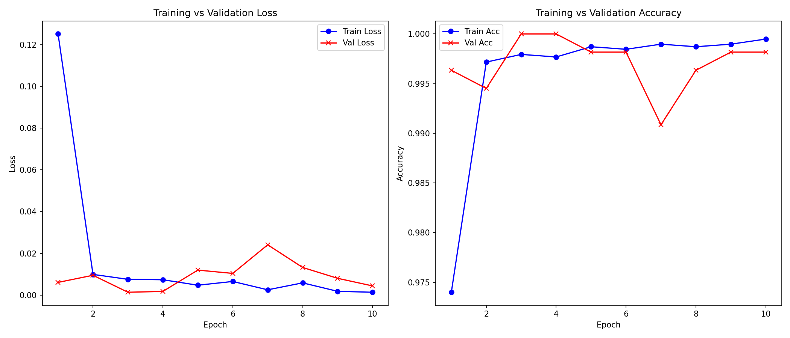
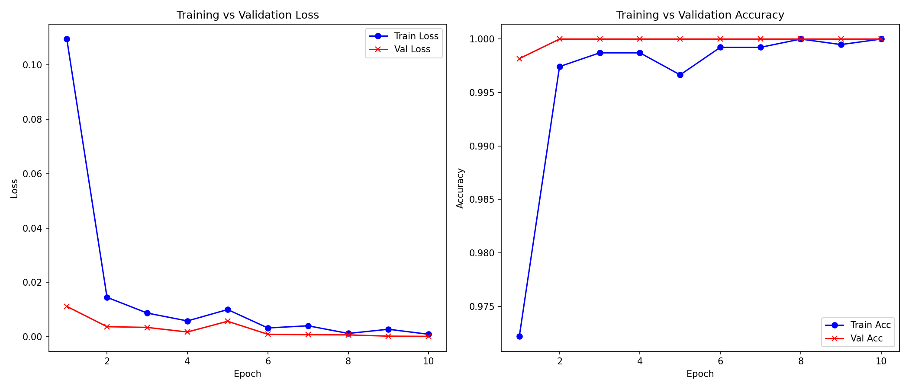
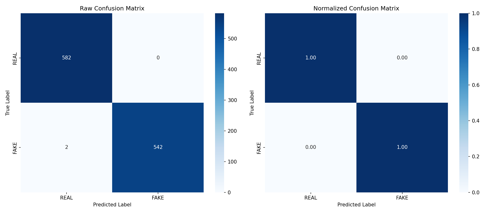

# Klasifikasi Citra Wajah Asli vs. Palsu (StyleGAN3) Menggunakan PyTorch

Proyek ini dibangun untuk mendeteksi manipulasi wajah atau deepfake dengan membandingkan wajah asli atau REAL dan wajah buatan AI atau FAKE berbasis arsitektur **EfficientNet-B3** dan **Xception** dengan framework **PyTorch**.

---

## Nama Anggota Kelompok

*   **Anindya Sukma Dwiyanda** - NIM: `103132400006`
*   **Jeremy Marcello** - NIM: `2311110003`

---

## Deskripsi Permasalahan
Perkembangan teknologi Generative Adversarial Networks atau GAN, khususnya **StyleGAN3**, kini mampu menghasilkan citra wajah manusia buatan komputer dengan tingkat realisme sangat tinggi atau photorealistic. Citra palsu ini sangat sulit dibedakan dari wajah asli oleh mata manusia biasa. Hal ini menimbulkan potensi ancaman keamanan berupa penyebaran disinformasi, penipuan identitas, maupun manipulasi media sosial. 

Oleh karena itu, proyek ini bertujuan untuk membangun sebuah sistem deteksi otomatis berbasis Deep Learning yang mampu mengklasifikasikan wajah secara akurat ke dalam kelas **REAL** sebagai wajah asli atau **FAKE** sebagai wajah palsu buatan StyleGAN3.

---

## Sumber dan Deskripsi Dataset
*   **Sumber Dataset**: Dataset bersumber dari Kaggle Deepfake Detection Dataset 2026 yang juga tersedia secara lokal dalam folder dataset/archive.zip dan diekstrak menjadi dataset/FINAL_DATASET.csv.
*   **Deskripsi Data**:
    *   **Jumlah Baris**: 6.557 data gambar.
    *   **Distribusi Kelas**: 
        *   **REAL**: 2.790 gambar asli yang bersumber dari Unsplash.
        *   **FAKE**: 3.767 gambar palsu yang dihasilkan melalui StyleGAN3.
    *   **Fitur Tabular/Metadata**: Kolom seperti `gender`, `age_group`, `image_quality`, `resolution`, `confidence_score`, `detection_difficulty`, dan `dataset_split`.
*   **Akses Gambar**: Citra diunduh langsung dari tautan URL pada kolom `image_url` menggunakan skrip pengunduh paralel.

---

## Tahapan Preprocessing
1.  **Validasi Citra**: Selama proses pengunduhan di src/downloader.py, setiap gambar yang berhasil diunduh dibuka menggunakan PIL Image.open().convert('RGB') untuk mendeteksi file korup dan disimpan seragam dalam format JPEG berkualitas tinggi dengan tingkat kualitas 92.
2.  **Transformasi & Augmentasi Training**:
    *   Mengubah resolusi gambar secara dinamis sebesar 300x300 piksel untuk EfficientNet-B3 dan 299x299 piksel untuk Xception.
    *   Penerapan augmentasi acak: RandomHorizontalFlip dengan probabilitas 0.5, RandomRotation sebesar 15 derajat, dan ColorJitter untuk brightness, contrast, serta saturation masing-masing sebesar 15% guna mencegah model menghafal dataset.
    *   Normalisasi standar ImageNet (`mean=[0.485, 0.456, 0.406]`, `std=[0.229, 0.224, 0.225]`).
3.  **Transformasi Validasi & Pengujian**:
    *   Resize resolusi gambar sesuai model tanpa augmentasi acak.
    *   Normalisasi standar ImageNet.

---

## Metode yang Digunakan
1.  **Arsitektur Model**:
    *   **EfficientNet-B3**: Model pretrained dengan arsitektur efisien berbasis MBConv atau Mobile Inverted Bottleneck Convolution, diadaptasi dengan output biner logit.
    *   **Xception**: Model pretrained berbasis Depthwise Separable Convolution yang memiliki performa klasifikasi kuat.
2.  **Fungsi Loss (Loss Function)**:
    *   BCEWithLogitsLoss dengan perhitungan otomatis bobot kelas pos_weight untuk menangani ketidakseimbangan kelas atau class imbalance antara REAL sebanyak 2.790 sampel dan FAKE sebanyak 3.767 sampel.
3.  **Optimizer**:
    *   `AdamW` dengan learning rate $10^{-4}$ dan dilengkapi regularisasi weight decay untuk membatasi kompleksitas bobot model.
4.  **Checkpointing**:
    *   Menyimpan model terbaik berdasarkan akurasi validasi tertinggi di setiap epoch untuk menghindari model yang mengalami overfitting pada epoch akhir.

---

## Cara Menjalankan Program

### 1. Instalasi Dependensi
```bash
# Menginstal paket dependensi yang dibutuhkan secara langsung
pip install torch torchvision timm scikit-learn pandas matplotlib seaborn pillow tqdm flask
```

### 2. Jalankan Pengunduh Citra
```bash
python src/downloader.py --workers 8
```

### 3. Eksplorasi Data Analitis (EDA)
```bash
python eda.py
```

### 4. Pelatihan Model
*   **Melatih Model EfficientNet-B3 (Default)**:
    ```bash
    python train.py --model efficientnet_b3 --epochs 10 --batch_size 32 --lr 1e-4
    ```
*   **Melatih Model Xception**:
    ```bash
    python train.py --model xception --epochs 10 --batch_size 32 --lr 1e-4
    ```

### 5. Prediksi Gambar Tunggal (Inferensi)
```bash
python predict.py --image_path <path_ke_gambar.jpg> --model efficientnet_b3 --model_path checkpoints/best_efficientnet_b3.pth
```

### 6. Menjalankan Demo Web Interaktif
```bash
python app.py
```
Setelah server aktif, buka browser dan akses `http://localhost:5000`.

---

## Spesifikasi Perangkat Keras Minimum

Untuk menjalankan program ini secara optimal, berikut adalah spesifikasi perangkat keras minimum yang disarankan:

### A. Untuk Proses Pelatihan
*   **CPU**: Intel Core i5 / AMD Ryzen 5 generasi ke-8 atau yang lebih baru.
*   **RAM**: Minimal 16 GB atau disarankan 32 GB untuk menghindari kendala memori pada dataloader multiprocessing.
*   **GPU (Kartu Grafis)**: Kartu Grafis NVIDIA dengan CUDA support, minimal memiliki **8 GB VRAM** seperti RTX 3060, RTX 4060, atau T4 GPU pada Google Colab.
    > *Catatan: Pelatihan pada CPU sangat tidak disarankan karena akan memakan waktu sangat lama.*

### B. Untuk Proses Inferensi dan Demo Web
*   **CPU**: Intel Core i3 / AMD Ryzen 3 atau setara.
*   **RAM**: Minimal 8 GB.
*   **GPU**: Tidak wajib atau bersifat opsional. Inferensi gambar tunggal pada CPU hanya memakan waktu 1 hingga 2 detik per gambar.

---

## Hasil Eksperimen dan Evaluasi

Berikut adalah metrik performa final yang diperoleh setelah mengevaluasi model terbaik pada data pengujian atau Test Set:

| Model | Loss Test | Akurasi Test | F1-Score Test | ROC-AUC Test |
| :--- | :---: | :---: | :---: | :---: |
| **EfficientNet-B3** | 0.0044 | **99.81%** | **99.82%** | **1.0000** |
| **Xception** | 0.0001 | **100.00%** | **100.00%** | **1.0000** |

---

### Visualisasi Kurva Pelatihan & Confusion Matrix

#### A. EfficientNet-B3

##### Kurva Pelatihan

*   **Penjelasan Kurva**:
    *   **Loss Curve**: Baik Train Loss maupun Validation Loss menurun secara konsisten dari epoch pertama hingga epoch ke-10, mencapai nilai di bawah $0.005$. Penurunan paralel ini menandakan model belajar secara stabil tanpa mengalami overfitting, yang ditandai jika Validation Loss tiba-tiba naik kembali.
    *   **Accuracy Curve**: Akurasi pelatihan dan validasi meningkat cepat dan berhimpitan erat di kisaran $99.8\%$, membuktikan bahwa model memiliki kemampuan generalisasi yang sangat stabil untuk data baru.

##### Confusion Matrix

*   **Penjelasan Confusion Matrix**:
    *   Model EfficientNet-B3 memprediksi hampir seluruh citra dengan sempurna pada data uji dengan hanya terjadi 2 kesalahan klasifikasi dari 1.126 total citra pengujian. Ini menunjukkan tingkat kesalahan false positive maupun false negative yang sangat minimal.

---

#### B. Xception

##### Kurva Pelatihan

*   **Penjelasan Kurva**:
    *   **Loss Curve**: Validation Loss menurun dengan sangat mulus hingga mencapai nilai sangat kecil sebesar 0.0001. Kurva validasi berada di bawah kurva training, menunjukkan model sangat percaya diri dalam pengujian berkat generalisasi yang kuat dari fitur Xception.
    *   **Accuracy Curve**: Akurasi validasi mencapai $100\%$ sempurna sejak epoch ke-2 dan bertahan stabil, sementara akurasi training menyusul di epoch ke-8.

##### Confusion Matrix

*   **Penjelasan Confusion Matrix**:
    *   Matriks menunjukkan klasifikasi **$100\%$ sempurna** (nilai diagonal bernilai penuh, tidak ada gambar REAL yang terdeteksi FAKE maupun sebaliknya). Seluruh 1.126 citra uji berhasil diklasifikasikan dengan benar tanpa kesalahan sama sekali.

---

## Keterbatasan Model & Analisis Generalisasi

Meskipun model mencapai akurasi uji atau test set accuracy yang mendekati sempurna pada dataset pengujian Kaggle, model ini memiliki keterbatasan generalisasi di dunia nyata yang disebabkan oleh Domain Overfitting atau Dataset Bias:

*   **Penyebab**: Kelas REAL pada dataset latih hanya bersumber dari foto-foto profesional beresolusi tinggi di Unsplash yang diambil menggunakan kamera DSLR profesional dengan lensa tajam dan pencahayaan teratur serta minim noise. Di sisi lain, kelas FAKE buatan StyleGAN3 memiliki pola kebisingan piksel frekuensi tinggi khas gambar sintetis buatan AI.
*   **Akibat**: Saat diuji menggunakan foto selfie dari kamera handphone biasa, model cenderung mengklasifikasikan foto asli tersebut sebagai **`FAKE`**. Model secara keliru mengasosiasikan kebisingan sensor atau sensor noise dan kualitas kompresi pada kamera ponsel sebagai pola sidik jari generator GAN.

---

## Kesimpulan
*   Kedua model yang dikembangkan memiliki performa luar biasa dalam mendeteksi manipulasi wajah deepfake StyleGAN3 pada domain dataset yang sama, dengan akurasi pengujian di atas 99.8%.
*   **Xception** unggul secara performa dengan akurasi 100.0% pada data uji, didukung oleh nilai loss validasi yang sangat kecil sebesar 0.0001.
*   **EfficientNet-B3** dengan ukuran file 43.3 MB jauh lebih ringan dibandingkan Xception dengan ukuran file 83.5 MB. Sehingga, untuk kebutuhan deployment pada sistem dengan sumber daya terbatas seperti mobile atau edge, **EfficientNet-B3** merupakan pilihan yang lebih efisien dengan penurunan performa yang tidak signifikan.

---

## Saran Pengembangan Lanjutan

Untuk mengatasi bias dataset dan meningkatkan kemampuan generalisasi model pada foto sehari-hari dari kamera handphone, berikut adalah langkah pengembangan yang disarankan selanjutnya:

1.  **Simulasi Artifact Kamera pada Augmentasi Data**:
    Menambahkan teknik augmentasi data training yang mensimulasikan karakteristik foto handphone, seperti penambahan noise sensor berupa Gaussian Noise, efek buram berupa Motion atau Gaussian Blur, dan penurunan kualitas berkas berupa JPEG Compression. Hal ini bertujuan agar model tidak bergantung pada kejernihan piksel DSLR Unsplash.
2.  **Analisis Frekuensi atau Frequency Domain**:
    Melatih model menggunakan representasi domain frekuensi dengan metode Discrete Fourier Transform atau DFT alih-alih domain piksel spasial secara langsung. Generator GAN buatan StyleGAN3 meninggalkan pola berkala atau periodic artifacts di domain frekuensi yang sangat khas dan relatif lebih tahan terhadap variasi sensor kamera perekam.
